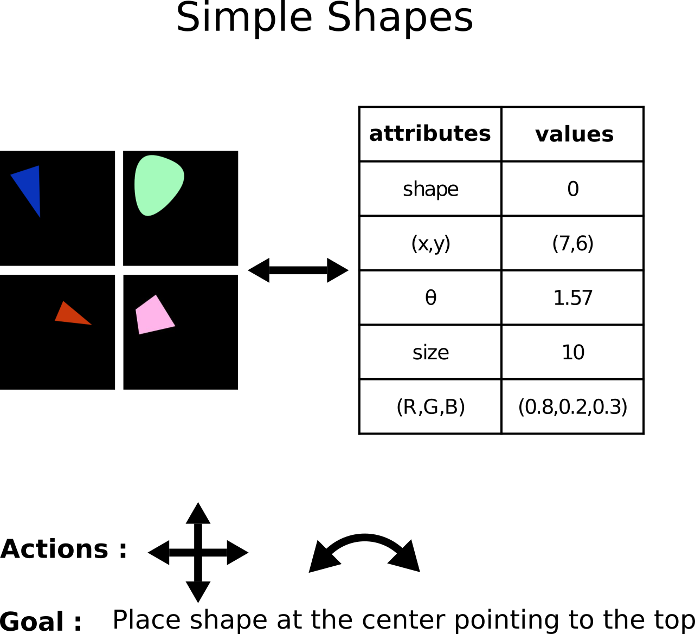
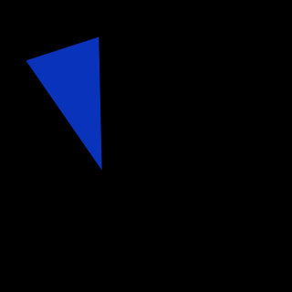
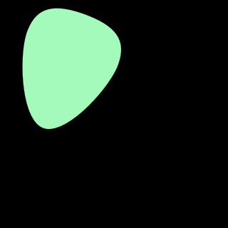
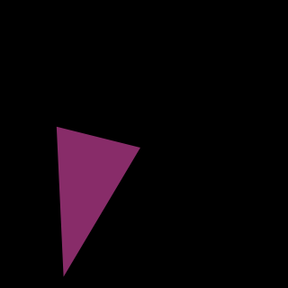

<div align="center">
    <h1>RL Simple Shapes</h1>
</div>

# Setup

## For development

```
git clone git@github.com:porthok/RL_Simple_Shapes.git & cd RL_Simple_Shapes
pip install -e .
```

## Quick install

```
pip install git+https://github.com/porthok/RL_Simple_Shapes.git
```

# Environment

This environment was implemented in the context of <b>Zero-shot cross-modal transfer of Reinforcement Learning policies through a Global Workspace</b> paper.

The environment is composed of a a shape contain in a 32x32 image. The images contain one shape (among a triangle, an "egg", and a "diamond") possessing different attributes:

* a size
* a location (x, y)
* a rotation
* a color

The goal of the agent is to place the shape at the center of the image pointing to the top. 



## Action
The shape can only translate or rotate at each time step. This leads to 6 different possible actions:
* Goes up by one pixel
* Goes down by one pixel
* Goes right by one pixel
* Goes left by one pixel
* Rotate right by an angle of $\frac{\pi}{32}$
* Rotate left by an angle of $\frac{\pi}{32}$

## Observation
This environment is made to be multimodal. By default, the it returns a dictionary composed of two modalities: `{'attr': attributes, 'v': image}`. But can also return only one of the two if specified.

### attributes
The attributes represent the state of the environment. It is a vector composed of 9 float for the different attributes of the shape.
* shape's class: 0 for diamond, 1 for egg, 2 for triangle
* x position $\in[0,32]$
* y position $\in[0,32]$
* size $\in[0,14]$
* cosinus of the rotation -1 and 1 $\in[-1,1]$
* sinus of the rotation -1 and 1 $\in[-1,1]$
* the RGB color $\in[0,255]^{3}$

`
spaces.Dict({
'attr': spaces.Box(low=np.array([0, -32, -32, 7, -1, -1, 0, 0, 0]), high=np.array([2, 32, 32, 14, 1, 1, 255, 255, 255])),
'v': spaces.Box(low=0, high=255, shape=(32,32,3))})
`

### image
The visual part is a 32x32 RGB image between 0 and 255 like the following ones




# Link with the Global Workspace

This environment was created to evaluate the model introduced by this paper: Semi-supervised multimodal representation learning through a global workspace.

A wrapper allows to use this model to encode the observation through it.

The model contains uni-modal modules which are pretrained:

- a VAE for the visual domain: available in `checkpoints/vae_v.ckpt`,
- the attribute model which doesn't requires any learning.

## Checkpoints

# Scripts

Different scripts are already written to play with this environment.

* `train.py`
* `test.py`
* `visualisation.py`

# Structure


# Citation
Please ensure proper citations when incorporating this work into your projects.

```bibtex
@article{
}
```
