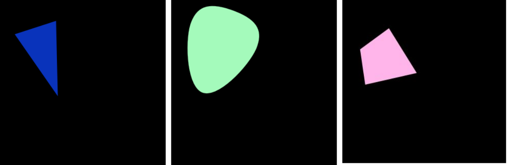
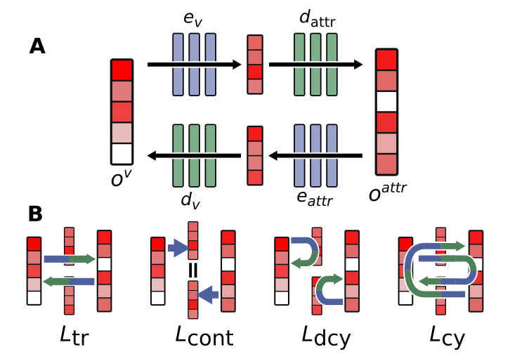

<div align="center">
    <h1>RL Simple Shapes</h1>
</div>

# Setup

## For development

```
git clone git@github.com:porthok/RL_Simple_Shapes.git & cd RL_Simple_Shapes
pip install -e .
```

## Quick install

```
pip install git+https://github.com/porthok/RL_Simple_Shapes.git
```

# Environment

This environment was implemented in the context of <b>Zero-shot cross-modal transfer of Reinforcement Learning policies through a Global Workspace</b> paper presented at the Reinforcement Learning Conference 2024.

The environment is composed of a a shape contain in a 32x32 image. The images contain one shape (among a triangle, an "egg", and a "diamond") possessing different attributes:

* a size
* a location (x, y)
* a rotation
* a color

The goal of the agent is to place the shape at the center of the image pointing to the top. 


## Action
The shape can only translate or rotate at each time step. This leads to 6 different possible actions:
* Goes up by one pixel
* Goes down by one pixel
* Goes right by one pixel
* Goes left by one pixel
* Rotate right by an angle of $\frac{\pi}{32}$
* Rotate left by an angle of $\frac{\pi}{32}$

## Observation
This environment is made to be multimodal. By default, the it returns a dictionary composed of two modalities: `{'attr': attributes, 'v': image}`. But can also return only one of the two if specified.

`
spaces.Dict({
'attr': spaces.Box(low=np.array([0, -32, -32, 7, -1, -1, 0, 0, 0]), high=np.array([2, 32, 32, 14, 1, 1, 255, 255, 255])),
'v': spaces.Box(low=0, high=255, shape=(32,32,3))})
`

### attributes
The attributes represent the state of the environment. It is a vector composed of 9 float for the different attributes of the shape.
* shape's class: 0 for diamond, 1 for egg, 2 for triangle
* x position $\in[0,32]$
* y position $\in[0,32]$
* size $\in[0,14]$
* cosinus of the rotation -1 and 1 $\in[-1,1]$
* sinus of the rotation -1 and 1 $\in[-1,1]$
* the RGB color $\in[0,255]^{3}$

`
spaces.Box(low=np.array([0, -32, -32, 7, -1, -1, 0, 0, 0]), high=np.array([2, 32, 32, 14, 1, 1, 255, 255, 255]))
`


### image
The visual part is a 32x32 RGB image between 0 and 255 like the following ones.


`
spaces.Box(low=0, high=255, shape=(32,32,3))
`

# Link with the Global Workspace

This environment was created to evaluate the model introduced by the paper "Semi-supervised multimodal representation learning through a global workspace".

This model is inspired from the Global Workspace introduced by Baars in the Cognitive Science field. It has been adapted to link multimodal data in a central space. This implementation posses 2 modalities, vision and attributes. The raw data are encoded to unimodal latent vectors ($o^v$ or $o^{attr}$) thanks to pre-trained models (VAE for vision, and simple normalization for attributes). These two vectors are then linked to the multimodal latent vector thanks to a set of encoders and decoders.
This model is trained with different losses illustrated in the part B of the following Figure. If you want to learn more about this model, please read:
* Semi-supervised multimodal representation learning through a global workspace, B. Devillers, L. Maytie, R. VanRullen, IEEE Transactions on Neural Networks and Learning Systems, 2024

or

* Zero-shot cross-modal transfer of Reinforcement Learning policies through a Global Workspace, L. Maytie, B. Devillers, A. Arnold, R. VanRullen, Reinforcement Learning Journal 2024



The goal was to test if zero-shot cross-modal policy transfer was possible using this model. Different models have been used in the paper trained with different amount of data and different losses. The checkpoints of these trainings are available at the `Simple_Shapes_RL/checkpoints/` folder. 

## Checkpoints
The different checkpoints used in <b>Zero-shot cross-modal transfer of Reinforcement Learning policies through a Global Workspace</b> paper are available in this folder `Simple_Shapes_RL/checkpoints/`

* `VAE_ckpt/`: contains the checkpoint of the VAE used to convert raw images to unimodal latent vector $o^v$
* `GW_5000_ckpt/`: contains the checkpoint of the GW trained with all the losses $(L_{tr}+L_{cont}+L_{dcy}+L_{cy})$ and with 5000 paired images-attributes
* `GW_ckpt/`: contains the checkpoint of the GW trained with all the losses $(L_{tr}+L_{cont}+L_{dcy}+L_{cy})$ and with 500 000 paired images-attributes
* `GW_cont_5000_ckpt/`: contains the checkpoint of the GW trained with the contrastive loss only $(L_{cont})$ and with 5000 paired images-attributes
* `GW_cont_ckpt/`: contains the checkpoint of the GW trained with the contrastive loss only $(L_{cont})$ and with 500 000 paired images-attributes
* `GW_trad_cont_5000_ckpt/`: contains the checkpoint of the GW trained with the contrastive and translation losses only $(L_{tr}+L_{cont})$ and with 5000 paired images-attributes
* `GW_trad_cont_ckpt/`: contains the checkpoint of the GW trained with the contrastive and translation losses only $(L_{tr}+L_{cont})$ and with 500 000 paired images-attributes

# Scripts

Different scripts are already written to play with this environment.

* `train.py`: To train a RL algorithm using PPO stable baselines 3 and the Global Workspace
* `test.py`: To test a model
* `visualisation.py`: To visualize the policy learnt by PPO

# Citation
Please ensure proper citations when incorporating this work into your projects.

```bibtex
@article{maytie2024zero,
    title={Zero-shot cross-modal transfer of Reinforcement Learning policies through a Global Workspace},
    author={Mayti{\'{e}}, L{\'{e}}opold and Devillers, Benjamin and Arnold, Alexandre and VanRullen, Rufin},
    journal={Reinforcement Learning Journal},
    volume={3},
    pages={1410--1426},
    year={2024}
}
```
